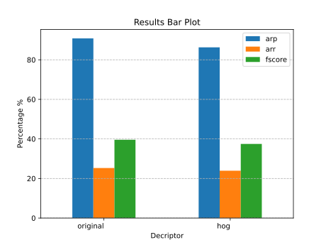
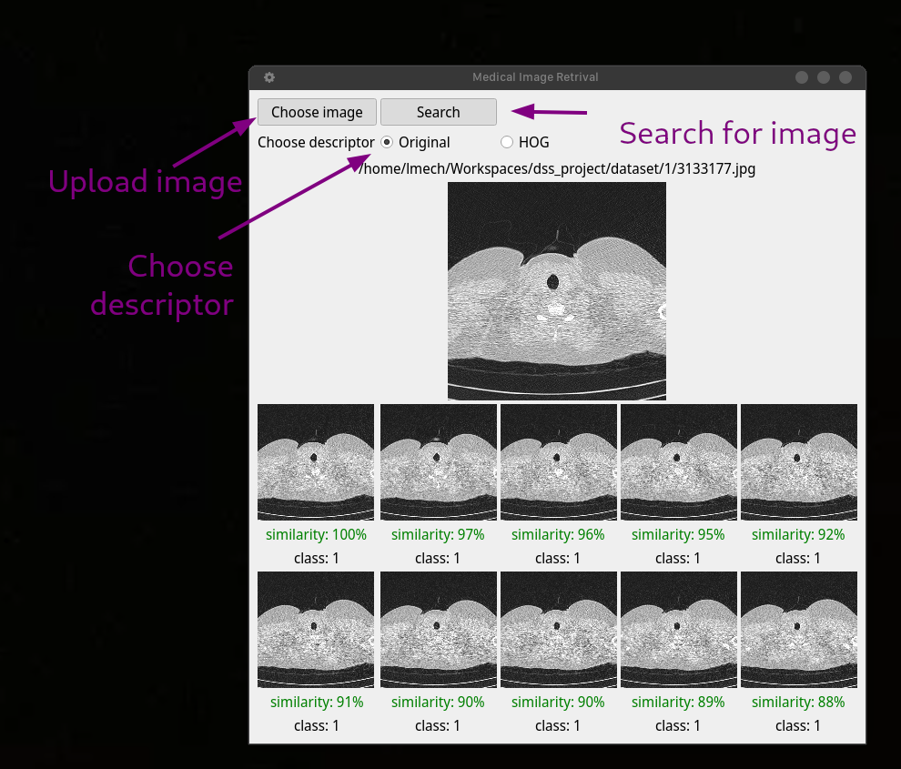

# Texture Features for Medical Images Retrival

An implementation of [A simple texture feature for retrieval of medical images](https://doi.org/10.1007/s11042-017-5341-2) by Rushi Lan, Si Zhong, Zhenbing Liu, Zhuo Shi & Xiaonan Luo for applying texture features in medical images retrival and a comparison between the original filters and prebuilt descriptor Historgram of Orentation Gradients (HOG).

## Setup

1. To run this project, download the project locally using:
`git clone https://github.com/LMech/Texture-Features-for-Medical-Images-Retrival.git`.
2. Install the requirements using:
`pip install -r requirements`.

## Run

The script divided into five parts preprocessing, training, evaluating, and user interface.

1. Preprocessing script `preprocess.py` for preporcessing the dataset according to the specified descriptor `original` or `hog` to apply filters according to the chosen descriptor and saved at `preprocessed_data/{descriptor}/`.
`python preprocess.py {descriptor}`
2. Training script for training the data using KMeans according to specified descriptor and the trained model saved as `{descriptor}_kmeans.pkl` and the evaluated histogram saved as `{descriptor}_histogram.npy` at `models/{descriptor}`.
`python train.py {descriptor}`
3. Label generator script for evaluating each image in the data set and calculate the number of matched images, percision, recall at `models/hog/{descriptor}_evaluation.csv`.
`python evaluation/generate_label.py {descriptor}`
4. UI script to run a QT desktop application to facilitate image retrival process.
`python ui/ui.py`

## Results

After applying both descriptorthe feature extration process from the original paper managed to achieve 90.83% ARP and the prebuild HOG descriptor achieved 86.3% ARP both trained and evaluated on the full data set.

## Screenshot

## References

1. Cordelia Schmid. Constructing models for content-based image retrieval. IEEE International Conference on Computer Vision and Pattern Recognition (CVPR ’01), Dec 2001, Kauai, United States.
pp.11–39, ff10.1109/CVPR.2001.990922ff. ffinria-00548274f

2. Lan, R., Zhong, S., Liu, Z. et al. A simple texture feature for retrieval of medical images. Multimed Tools Appl 77, 10853–10866 (2018).
